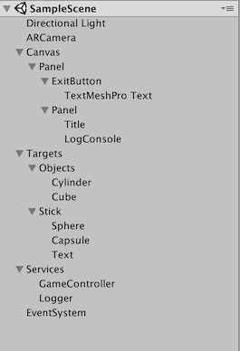

# VuforiaExternalCameraSample

A sample of Vuforia ImageTarget detection without real camera. This uses locally stored images as camera images.

## Significance

Previous Vuforia could not use local image files for camera images but from Vuforia 7.5 it is now possible to use local image files as camera images with the feature of External Camera!

## Demo

[](https://youtu.be/HlKqb6DeW54)

## Official documentation

- [What is Vuforia External Camera?](https://library.vuforia.com/articles/Solution/external-camera.html)
- [How build FileDrive.dll](https://library.vuforia.com/articles/Solution/file-driver.html)

## Structure

It is amazing! You do not need a camera!

```
_________________________
| Sequenced image files |
| in your PC.           |
| e.g. image00000.png   |
|      image00001.png   |
|_______________________|
    |
    | Read image
_______________________________
| This application is         |
| UWP app that build by Unity.|
| __________________________  |
| | Vuforia                 | |
| | _______________________ | |
| | | FileDriver.dll      | | |
| | |                     | | |
| | | This is an External | | |
| | | Camera Driver.      | | |
| | |                     | | |
| | | Read images from    | | |
| | | files instead of    | | |
| | | actual cameras.     | | |
| | |_____________________| | |
| |_________________________| |
|_____________________________|

```

## Hint

**Caution!!** This repository contains only a subset of the files in the Unity project. Because the files in the Unity project are too big and I did not want to include Vuforia's license key in this repository.

- CameraLocader.cs: A CameraLocader loads FileDriver.dll
- StreamingAssets directory: A sequenced images
- StreamingAssets/sequence.txt: A camera config file

### Unity Hierarchy


